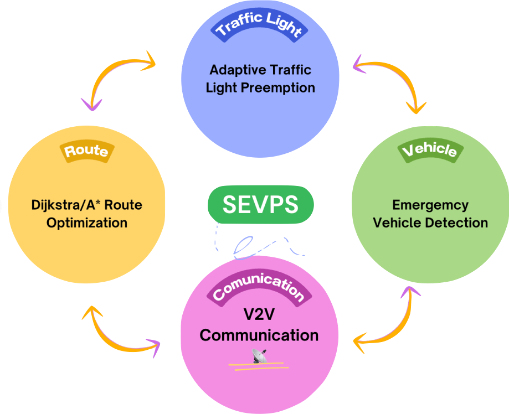

 # Smart Emergency Vehicle Priority System (SEVPS)

A Python-based simulation system that optimizes traffic flow for emergency vehicles using SUMO, TraCI, and AI techniques.

## Features

- **Dynamic Route Optimization**: Uses Dijkstra's algorithm to find optimal routes for emergency vehicles
- **Traffic Light Control**: Implements Deep Q-Learning for intelligent traffic light control
- **Congestion Prediction**: Uses LSTM networks to predict traffic congestion
- **V2X Communication**: Simulates vehicle-to-vehicle and vehicle-to-infrastructure communication
- **Real-time Visualization**: Provides real-time metrics and performance visualization


## Requirements

- Python 3.8+
- SUMO 1.22.0
- TensorFlow 2.8.0+
- PyTorch 1.10.0+
- Other dependencies listed in `requirements.txt`

## Installation

1. Clone the repository:
```bash
git clone <repository-url>
cd sevps
```

2. Install dependencies:
```bash
pip install -r requirements.txt
```

3. Make sure SUMO is installed and the `SUMO_HOME` environment variable is set.

## Project Structure

```
sevps/
├── src/
│   ├── main.py              # Main simulation orchestration
│   ├── router.py            # Route optimization
│   ├── controller.py        # Traffic light control
│   ├── predictor.py         # Congestion prediction
│   ├── v2x.py              # V2X communication
│   └── utils/
│       ├── metrics.py       # Metrics collection
│       └── visualization.py # Real-time visualization
├── requirements.txt
└── README.md
```

## Usage

1. Start the simulation:
```bash
python src/main.py
```

2. Monitor the simulation in SUMO-GUI and the real-time metrics plots.

## Components

### Route Optimization
- Uses Dijkstra's algorithm with dynamic weights
- Considers current traffic conditions and congestion
- Optimizes for emergency vehicle response time

### Traffic Light Control
- Deep Q-Learning for adaptive traffic light control
- Prioritizes emergency vehicle passage
- Balances traffic flow and emergency response

### Congestion Prediction
- LSTM-based prediction of traffic congestion
- Uses historical and real-time traffic data
- Helps in proactive route planning

### V2X Communication
- Simulates V2V and V2I communication
- Alerts nearby vehicles of emergency vehicles
- Coordinates with traffic infrastructure

### Metrics and Visualization
- Real-time performance metrics
- Interactive plots using Matplotlib and Plotly
- Comprehensive data logging

## Performance Metrics

- Emergency vehicle response time
- Traffic light efficiency
- Average vehicle speed
- Total waiting time
- Congestion levels

## Acknowledgments

- SUMO (Simulation of Urban MObility)
- TraCI (Traffic Control Interface)
- TensorFlow and PyTorch communities
